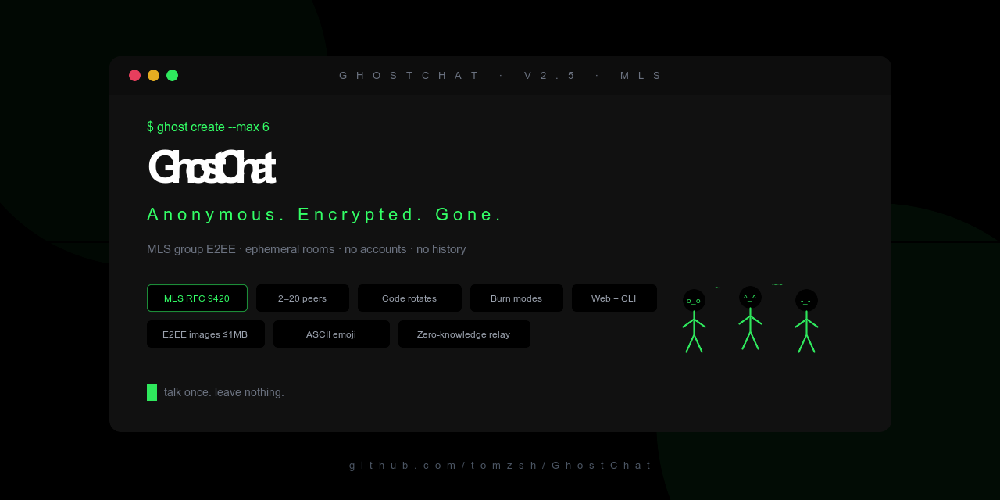

# GhostChat

<p align="center">
  
</p>

<p align="center">
  <a href="./README.md">English</a> · <strong>Bahasa Indonesia</strong>
  · <a href="https://github.com/tomzsh/ghostchat/releases/tag/v2.1.0">v2.1.0</a>
</p>

Chat 1:1 **anonim**, **ephemeral**, dan **terenkripsi end-to-end**.  
Tanpa akun. Tanpa riwayat permanen. Tanpa plaintext di server.

> Privacy by design: server hanya **relay** ciphertext. Saat room kosong, state in-memory dihancurkan.

**AI / coding agents:** mulai dari **[AGENTS.md](./AGENTS.md)** (peta arsitektur, aturan keras, perintah).

---

## Daftar isi

1. [Ringkasan](#ringkasan)
2. [Fitur](#fitur)
3. [Arsitektur](#arsitektur)
4. [Struktur repositori](#struktur-repositori)
5. [Prasyarat](#prasyarat)
6. [Mulai cepat](#mulai-cepat)
7. [Aplikasi web](#aplikasi-web)
8. [CLI](#cli)
9. [Worker / API](#worker--api)
10. [Protokol](#protokol)
11. [Kriptografi](#kriptografi)
12. [Model keamanan](#model-keamanan)
13. [Konfigurasi](#konfigurasi)
14. [Skrip](#skrip)
15. [Pengujian](#pengujian)
16. [Deploy](#deploy)
17. [Pemecahan masalah](#pemecahan-masalah)
18. [Roadmap](#roadmap)
19. [Lisensi](#lisensi)

---

## Ringkasan

GhostChat menyelesaikan masalah spesifik: **ngobrol dengan satu orang lain, sekarang, secara privat, tanpa meninggalkan jejak yang awet**.

| Aspek | Perilaku |
|---|---|
| Identitas | `Anon-XXXX` acak per sesi — tanpa registrasi |
| Penyimpanan | Tidak ada riwayat pesan di server |
| Enkripsi | **MLS (RFC 9420)** di client (`ts-mls`); server hanya relay ciphertext |
| Akses room | Kode 6 karakter (atau link / QR) |
| Siklus hidup | Musnah saat kosong, idle 10 menit, atau usia maks 24 jam |

Klien: **Web (Next.js)** dan **CLI (`ghost`)** memakai backend Cloudflare Worker yang sama.

---

## Fitur

### Produk (MVP)

- Buat / join room 1:1 (maksimal 2 peserta)
- Chat realtime lewat WebSocket
- Enkripsi end-to-end (kunci privat tidak pernah meninggalkan client)
- Indikator mengetik + animasi ASCII “orang chatting” (web)
- Pesan self-destruct (**Burn after** / terbakar: baca / 10s / 60s)
- **Safety number** — kedua pihak membandingkan angka untuk deteksi MITM
- **QR code** untuk join lewat kamera HP (web)
- Salin / share native kode room
- Tutup room (keluar eksplisit)
- Indikator kesehatan relay di landing
- UI CLI bergaya terminal

### Infrastruktur

- Cloudflare Workers + Durable Objects (satu DO = satu room)
- Desain room ramah WebSocket Hibernation
- Rate limit: buat room & percobaan join per IP
- REST same-origin lewat rewrite Next.js
- Unit test untuk crypto, util bersama, rate limiter

---

## Arsitektur

```
┌──────────────┐         WSS          ┌─────────────────────────────┐
│  Klien Web   │ ───────────────────▶ │  Cloudflare Worker          │
│  (Next.js)   │         HTTPS        │  POST/GET /api/rooms        │
└──────────────┘                      │  WS   /ws/:roomId           │
                                      │            │                │
┌──────────────┐         WSS          │            ▼                │
│  Klien CLI   │ ───────────────────▶ │  Durable Object: Room       │
│  (Node.js)   │                      │  · koneksi (maks 2)         │
└──────────────┘                      │  · hanya relay ciphertext   │
                                      └─────────────────────────────┘
         Kunci privat & plaintext tidak pernah meninggalkan client
```

**Alur pesan:**

1. Peer A mengenkripsi plaintext dengan kunci AEAD bersama → `ciphertext` + `nonce`
2. Durable Object meneruskan frame ke peer B (tanpa dekripsi)
3. Peer B mendekripsi di lokal; TTL/`burn` menyelaraskan penghapusan di UI

---

## Struktur repositori

```
ghostchat/
├── apps/
│   ├── web/                 # Next.js 15 (App Router) + Tailwind
│   ├── worker/              # Cloudflare Worker + Room Durable Object
│   └── cli/                 # ghost create | ghost join
├── packages/
│   ├── crypto/              # MLS (ts-mls) + helper pairwise legacy
│   ├── protocol/            # Tipe & parser pesan WebSocket
│   └── shared/              # Kode room, limit, helper TTL
├── package.json             # Root workspace pnpm
├── README.md                # English
└── README.id.md             # Dokumen ini (Bahasa Indonesia)
```

---

## Prasyarat

| Alat | Versi |
|---|---|
| Node.js | ≥ 20 |
| pnpm | 9.x (lihat field `packageManager` di root) |
| Akun Cloudflare | Hanya untuk deploy worker produksi |

---

## Mulai cepat

```bash
# 1. Instal dependensi
pnpm install

# 2. Build package bersama (otomatis juga lewat predev:*)
pnpm build:packages

# 3. Terminal A — relay
pnpm dev:worker
# → http://127.0.0.1:8787

# 4. Terminal B — UI web
pnpm dev:web
# → http://localhost:3000
```

Buka web, **Create Room**, bagikan kode/QR ke browser kedua atau CLI.

---

## Aplikasi web

### Halaman

| Rute | Deskripsi |
|---|---|
| `/` | Landing: buat room, join dengan kode, status relay |
| `/r/[roomId]` | Room chat: pesan, burn TTL, QR, safety number |

### Catatan UX

- Layout **mobile-first**, safe area, target sentuh besar
- Selector **Burn after** (bukan label mentah “TTL”) + teks bantuan singkat
- **Safety number** muncul saat channel terenkripsi siap — harus sama di kedua sisi
- **QR** berisi `https://<origin>/r/<ROOM_ID>` agar bisa di-scan kamera
- Identitas sesi hanya di `sessionStorage` (bukan `localStorage`)

### Env lokal (`apps/web/.env.local`)

```bash
# Opsional. Jika kosong, REST memakai rewrite same-origin /api/* → worker.
# NEXT_PUBLIC_API_URL=http://127.0.0.1:8787

# WebSocket harus absolute
NEXT_PUBLIC_WS_URL=ws://127.0.0.1:8787

# Target rewrite server-side (Next config)
# WORKER_URL=http://127.0.0.1:8787
```

Salin dari `apps/web/.env.example` bila perlu.

Gunakan **`127.0.0.1`**, bukan `localhost`, agar browser tidak ke IPv6 `::1` saat Wrangler listen di IPv4.

---

## CLI

```bash
# Buat room dan masuk sesi
pnpm --filter @ghostchat/cli start create
pnpm --filter @ghostchat/cli start create --ttl 10s   # 10s | 60s | on_read

# Join room yang sudah ada
pnpm --filter @ghostchat/cli start join AB92KF
```

### Perintah dalam sesi

| Perintah | Fungsi |
|---|---|
| `/ttl on_read\|10s\|60s` | Ganti mode burn pesan keluar |
| `/who` / `/status` | Status + safety number |
| `/safety` / `/fp` | Tampilkan safety number saja |
| `/help` | Daftar perintah |
| `/quit` | Keluar room |

### Environment

| Variabel | Default |
|---|---|
| `GHOST_API_URL` | `http://127.0.0.1:8787` |
| `GHOST_WS_URL` | diturunkan dari API (`http` → `ws`) |
| `GHOST_WEB_URL` | `http://127.0.0.1:3000` (link saat create) |
| `NO_COLOR` | set untuk matikan warna ANSI |

---

## Worker / API

### REST

| Metode | Path | Deskripsi |
|---|---|---|
| `POST` | `/api/rooms` | Buat room → `{ roomId, wsUrl }` |
| `GET` | `/api/rooms/:id` | Status: `ok` / `not_found` / flag full |
| `GET` | `/health` | Hidup `{ ok: true }` |

### WebSocket

| Path | Deskripsi |
|---|---|
| `/ws/:roomId` | Upgrade; frame pertama harus `join` |

### Batas (default)

| Batas | Nilai |
|---|---|
| Max peserta / room | 2 |
| Max pesan / koneksi / detik | 5 |
| Max ukuran ciphertext (kira-kira) | 4 KB |
| Buat room / IP / menit | 10 |
| Probe join (GET + WS) / IP / menit | 30 |
| Idle timeout | 10 menit |
| Usia maksimal room | 24 jam |
| Grace room kosong | 30 detik |

Dikonfigurasi di `packages/shared` (`LIMITS`) dan ditegakkan di worker.

### Durable Object

- Kelas: `RoomDurableObject` (`apps/worker/src/room.ts`)
- Alamat: `idFromName(roomId)`
- **Tidak** menyimpan isi pesan — hanya metadata / alarm berumur pendek
- Sesi unik berdasarkan `sessionToken` client (aman untuk reconnect)

---

## Protokol

Semua frame JSON dengan `"v": 1`.

**Client → server (contoh):**

```json
{ "v": 1, "type": "join", "displayId": "Anon-4XJ9", "publicKey": "<base64>", "sessionToken": "..." }
{ "v": 1, "type": "message", "ciphertext": "...", "nonce": "...", "ttlMode": "60s", "messageId": "m_..." }
{ "v": 1, "type": "typing", "state": true }
{ "v": 1, "type": "burn", "messageId": "m_..." }
{ "v": 1, "type": "ping" }
```

**Server → client (contoh):**

```json
{ "v": 1, "type": "joined", "yourId": "Anon-4XJ9", "peerId": null, "peerPublicKey": null, "sessionToken": "..." }
{ "v": 1, "type": "peer_joined", "peerId": "Anon-7QW2", "peerPublicKey": "..." }
{ "v": 1, "type": "message", "from": "Anon-7QW2", "ciphertext": "...", "nonce": "...", "ttlMode": "60s", "messageId": "m_..." }
{ "v": 1, "type": "error", "code": "room_full" }
{ "v": 1, "type": "room_closed", "reason": "idle_timeout" }
```

Tipe TypeScript bersama ada di `packages/protocol`.

---

## Kriptografi

| Langkah | Algoritma | Library |
|---|---|---|
| Group E2EE | **MLS (RFC 9420)** | `ts-mls` |
| Ciphersuite | MLS_128_DHKEMX25519_AES128GCM_SHA256_Ed25519 | `ts-mls` / `@hpke/core` |
| Safety number | SHA-256 MLS `confirmedTranscriptHash` → `XXXXX XXXXX XXXXX` | `@noble/hashes` |
| Protocol | `PROTOCOL_VERSION = 2` | `@ghostchat/protocol` |

**Aturan:**

- Kunci privat & state MLS hanya di memori proses / tab
- Server hanya melihat frame ciphertext MLS + metadata kehadiran
- Safety number terikat epoch — bandingkan ulang setelah join; jika beda, anggap channel terkompromi
- `ts-mls` belum diaudit formal

### Apa itu “Burn after” (TTL)?

TTL = **Time To Live** — berapa lama pesan tampil di UI sebelum dihapus (terbakar). Ini kontrak **antar client**, bukan timer di server (server tidak menyimpan pesan).

| Mode | Arti |
|---|---|
| After read (`on_read`) | Hilang sebentar setelah penerima melihatnya |
| 10 seconds | Hilang ~10 detik setelah tampil |
| 60 seconds | Hilang ~60 detik setelah tampil |

---

## Model keamanan

### Dilindungi

- Penyadap jaringan / operator server tidak bisa membaca plaintext
- Tidak ada penyimpanan pesan awet yang bisa disubpoena setelah room musnah
- Tidak ada graf akun yang mengikat chat ke email/telepon

### Tidak dilindungi

- Endpoint terkompromi (malware, screen capture)
- Siapa pun yang punya kode room bisa jadi peserta ke-2 — **kode = rahasia akses**
- MITM saat key exchange awal jika kanal pembagian kode bermusuhan (mitigasi: **safety number**)
- Konten ilegal — server tidak bisa memoderasi ciphertext

### Mitigasi operasional

- Rate limit create/join
- Umur room pendek
- Perbandingan safety number opsional antar peer

---

## Konfigurasi

### Worker (`apps/worker/wrangler.toml`)

| Binding / var | Fungsi |
|---|---|
| `ROOMS` | Namespace Durable Object |
| `PUBLIC_WS_ORIGIN` | `wsUrl` hasil create (mis. `wss://….workers.dev`) |

Dev lokal listen di `0.0.0.0:8787`.

### Web

| Variabel | Fungsi |
|---|---|
| `NEXT_PUBLIC_API_URL` | Origin REST absolute (opsional) |
| `NEXT_PUBLIC_WS_URL` | Origin WebSocket absolute |
| `WORKER_URL` | Target rewrite server untuk `/api/*` |

---

## Skrip

Dari root monorepo:

| Skrip | Deskripsi |
|---|---|
| `pnpm install` | Instal semua workspace |
| `pnpm build:packages` | Build `shared`, `protocol`, `crypto` |
| `pnpm build` | Packages + build produksi Next |
| `pnpm dev:worker` | Worker lokal Wrangler |
| `pnpm dev:web` | Next dev (port 3000) |
| `pnpm dev:cli` | Entry CLI (`ghost`) |
| `pnpm typecheck` | Typecheck semua package |
| `pnpm test` | Unit test |
| `pnpm audit:local` | typecheck + test + build web |
| `pnpm clean` | Hapus artefak build |

`predev:web`, `predev:worker`, dan `predev:cli` otomatis menjalankan `build:packages`.

---

## Pengujian

```bash
pnpm test
```

| Package | Cakupan |
|---|---|
| `@ghostchat/crypto` | Kesepakatan ECDH, AEAD, tamper, safety number |
| `@ghostchat/shared` | ID room, parsing TTL |
| `@ghostchat/worker` | Rate limiter sliding window |

Ide uji manual:

1. Web create → CLI join → chat dua arah  
2. CLI create → Web join lewat kode atau QR  
3. Bandingkan safety number  
4. Refresh satu tab — sesi reconnect tanpa “room full”  
5. Close room — peer melihat leave / siklus room  

---

## Deploy

### Worker (Cloudflare)

```bash
cd apps/worker
# set PUBLIC_WS_ORIGIN=wss://subdomain-anda.workers.dev di wrangler.toml / dashboard
pnpm deploy
```

Memerlukan plan Workers yang mendukung **Durable Objects**.

### Web (mis. Vercel)

1. Root monorepo atau `apps/web` sebagai project  
2. Build: `pnpm build` (dari monorepo)  
3. Env:
   - `NEXT_PUBLIC_WS_URL=wss://worker-anda…`
   - `WORKER_URL=https://worker-anda…` (untuk rewrite)
   - opsional `NEXT_PUBLIC_API_URL=https://worker-anda…`

Atur CORS di worker jika browser memanggil origin worker secara langsung (rewrite menghindari ini untuk REST).

---

## Pemecahan masalah

| Gejala | Kemungkinan | Perbaikan |
|---|---|---|
| “relay offline” di landing | Worker tidak jalan | `pnpm dev:worker` |
| Error WebSocket | Host salah / IPv6 | Pakai `127.0.0.1` di `NEXT_PUBLIC_WS_URL` |
| Stuck “waiting for peer” | Double session lama / peer `room_full` | Hard refresh; kode terbaru; satu tab per peer |
| Tidak bisa send | Peer left / belum shared key | Tunggu peer; cek safety number setelah rejoin |
| Room not found | Kedaluwarsa atau salah ketik | Buat room baru |
| Rate limited | Terlalu banyak create/join | Tunggu ~1 menit |
| CLI tidak connect | Worker down / env salah | Cek `GHOST_API_URL` / `GHOST_WS_URL` |

---

## Roadmap

Kemungkinan lanjutan (tidak wajib untuk MVP):

- Checklist deploy produksi & multi-env  
- PWA / install ke Home Screen  
- Grace reconnect lebih lama di server  
- Passphrase room opsional  
- Scanner QR in-app  
- Post-quantum MLS ciphersuites (X-Wing / ML-KEM)

Di luar cakupan by design: akun, riwayat cloud, push notification, moderasi konten plaintext di server.

---

## Lisensi

Privat / belum ditentukan kecuali Anda menambahkan file lisensi. Tambahkan lisensi SPDX sebelum mempublikasikan.

---

**GhostChat** — ngobrol sekali. Tidak menyisakan apa pun.
